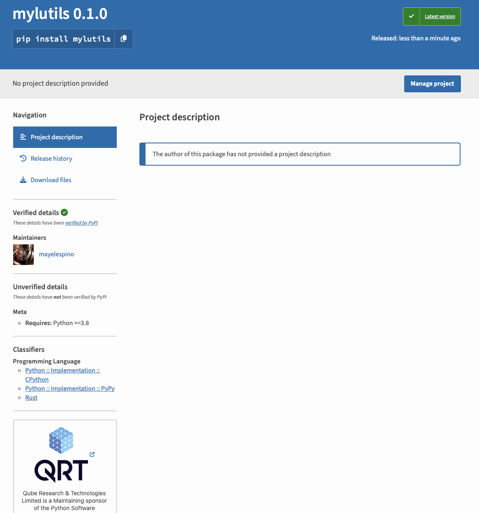

# pyrust

Extending Python with Rust

## mylfileutils

This was my first package, published to [pypi.org](http://pypi.org) using ```maturin publish`` nothing else, no special builds or considerations.




## Links

- [Writing and publishing a Python module in Rust](https://blog.yossarian.net/2020/08/02/Writing-and-publishing-a-python-module-in-rust)
- [How to create a PIP package hosted on private Github repo](https://dev.to/rf_schubert/how-to-create-a-pip-package-and-host-on-private-github-repo-58pa)
